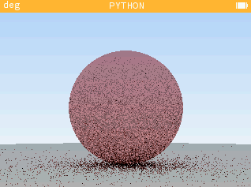
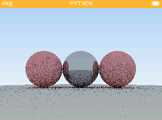
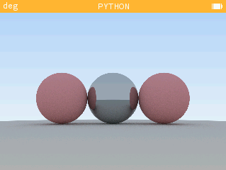

# Path-Tracer For Numwork #

Hey ! This program is a path-tracer engine for Numwork
It creates nice image on your calculator

but, do not expect to make a render during your
maths class, it will takes a long long time ahha

It seems like it's not running on Numwork it self (I was using an emulator), so I've min the script using https://python-minifier.com/

## Exemples ## 

Final Image using 100 samples in like 10 minutes on pc:

