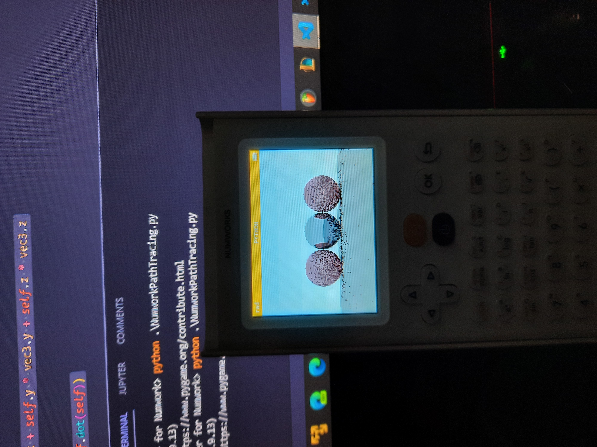

# Path-Tracer For Numworks #

Simple Path-Tracer for Numworks made for fun.

## How To Use ##

1. run ```git clone https://github.com/AntoineBRTL/PathTracer-for-Numwork.git .```
2. plug a Numworks to your pc.
3. connect [Numworks website](https://www.numworks.com/).
4. go to your script and add NumworkPathTracing.py to them.

This program has been developped in python using an emulator on windows, that's why you will probably need to [minimified](https://python-minifier.com/) it.
You may also change ```PathTracer.pixelShift```.

## Exemples ## 


Final Image using 100 samples in like 10 minutes on pc :


Let test it on a real Numworks : 



It worked but only using low resolution for now ...
